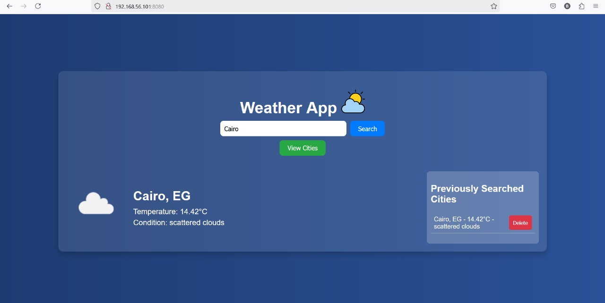
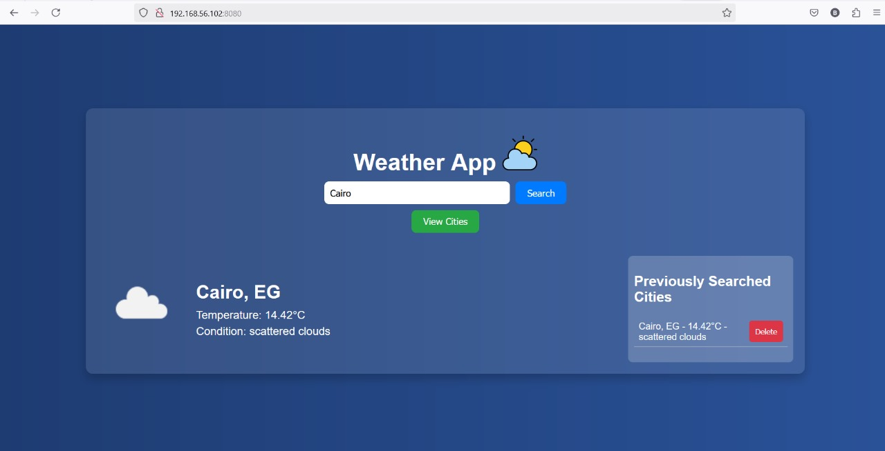
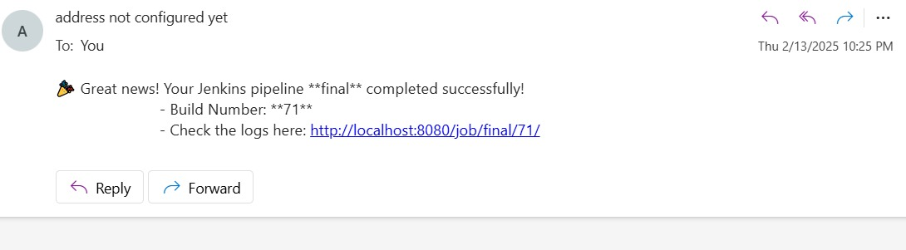

# Jenkins CI/CD Pipeline with Docker, Ansible, and Email Notifications

## Overview
This project automates the CI/CD process using **Jenkins**, **Docker**, and **Ansible**. The pipeline pulls the latest code from GitHub, builds and pushes a Docker image to Docker Hub, deploys the application using Ansible, and sends email notifications on success or failure.

## Technologies Used
- **Jenkins**: Automates the build, test, and deployment process.
- **Docker**: Containers for application deployment.
- **Ansible**: Automates deployment to remote servers.
- **GitHub**: Source code repository.
- **Email Notifications**: Alerts users on pipeline status.

## Pipeline Stages
1. **Checkout Code**: Clones the latest code from GitHub.
2. **Build Docker Image**: Builds the application’s Docker image.
3. **Login to Docker Hub**: Authenticates with Docker Hub.
4. **Push Docker Image to Docker Hub**: Pushes the built image.
5. **Run Ansible Playbook**: Deploys the application to the remote server.
6. **Post Actions**: Sends an email notification based on success or failure.

## Jenkins Pipeline Script
```groovy
pipeline {
    agent any

    environment {
        DOCKER_IMAGE = "basma227/flask-weather-app"
        DOCKER_TAG = "latest"
        DOCKER_HUB_CREDENTIALS = "docker-hub-credentials"
        GITHUB_CREDENTIALS = "github-credentials"
    }

    stages {
        stage('Checkout Code') {
            steps {
                script {
                    checkout([
                        $class: 'GitSCM',
                        branches: [[name: '*/main']],
                        userRemoteConfigs: [[
                            url: 'https://github.com/Basma-90/practice.git',
                            credentialsId: env.GITHUB_CREDENTIALS
                        ]]
                    ])
                }
            }
        }

        stage('Build Docker Image') {
            steps {
                script {
                    sh "docker build -t ${DOCKER_IMAGE}:${DOCKER_TAG} ."
                }
            }
        }

        stage('Login to Docker Hub') {
            steps {
                withCredentials([usernamePassword(credentialsId: env.DOCKER_HUB_CREDENTIALS, usernameVariable: 'DOCKER_USER', passwordVariable: 'DOCKER_PASS')]) {
                    sh "echo $DOCKER_PASS | docker login -u $DOCKER_USER --password-stdin"
                }
            }
        }

        stage('Push Docker Image to Docker Hub') {
            steps {
                script {
                    sh "docker push ${DOCKER_IMAGE}:${DOCKER_TAG}"
                }
            }
        }

        stage('Run Ansible Playbook') {
            steps {
                sshagent(credentials: ['ansible']) {
                    sh '''
                        chmod 600 /var/lib/jenkins/workspace/final/vagrant_key
                        ansible-playbook -i /var/lib/jenkins/workspace/final/inventory.yaml /var/lib/jenkins/workspace/final/playbook.yaml -u vagrant -vvv
                    '''
                }
            }
        }
    }

    post {
        success {
            emailext subject: "✅ Jenkins Pipeline Succeeded: ${env.JOB_NAME}",
                     body: """
                     🎉 Great news! Your Jenkins pipeline **${env.JOB_NAME}** completed successfully!
                     - Build Number: **${env.BUILD_NUMBER}**
                     - Check the logs here: ${env.BUILD_URL}
                     """,
                     recipientProviders: [[$class: 'CulpritsRecipientProvider']],
                     to: "basmasabry33333@gmail.com"
        }
        failure {
            emailext subject: "❌ Jenkins Pipeline Failed: ${env.JOB_NAME}",
                     body: """
                     ❌ Oops! The Jenkins pipeline **${env.JOB_NAME}** failed!
                     - Build Number: **${env.BUILD_NUMBER}**
                     - Check the logs here: ${env.BUILD_URL}
                     """,
                     recipientProviders: [[$class: 'CulpritsRecipientProvider']],
                     to: "basmasabry33333@gmail.com"
        }
    }
}
```

## Prerequisites
- **Jenkins** installed with required plugins:
  - Pipeline
  - Email Extension Plugin
  - SSH Agent Plugin
- **Docker** installed and configured.
- **Ansible** installed on the control node.
- **Jenkins Credentials**:
  - `docker-hub-credentials` (Docker Hub username & password)
  - `github-credentials` (GitHub token for repository access)
  - `ansible` (SSH key for Ansible deployment)
- **Email Configuration** in Jenkins for email notifications.

## Deployment Steps
1. Configure **Jenkins Credentials** for Docker Hub, GitHub, and SSH.
2. Ensure the target server is accessible via SSH.
3. Set up **Ansible inventory** and **playbook**.
4. Run the **Jenkins Pipeline**.

## Email Notifications
- **Success Email**: Sent when the pipeline completes successfully.
- **Failure Email**: Sent when the pipeline fails.

## Screenshots of the two target machines containers running



## Screenshot of the email sent 


## Conclusion
This Jenkins pipeline automates the CI/CD process by integrating **GitHub**, **Docker**, **Ansible**, and **Email Notifications** for a seamless deployment experience. 🚀

